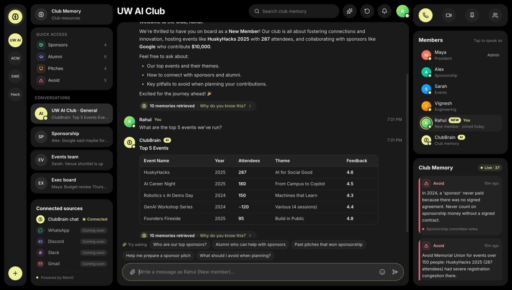
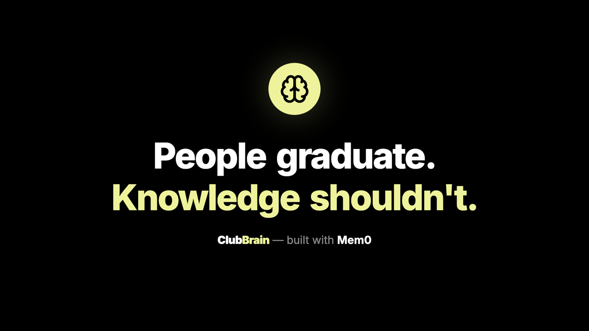
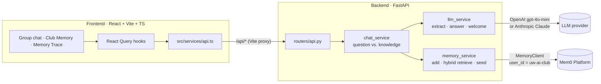
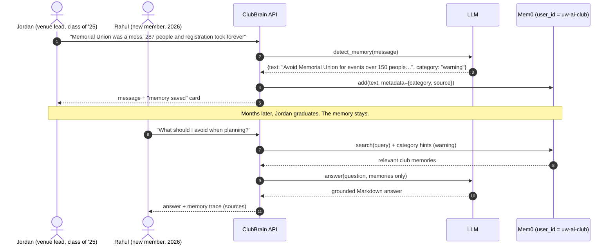
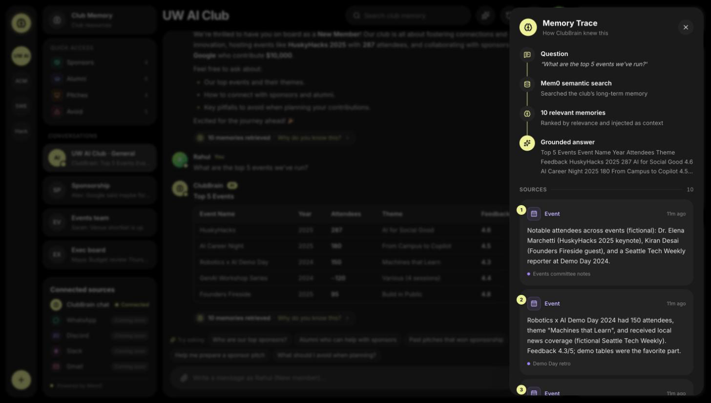
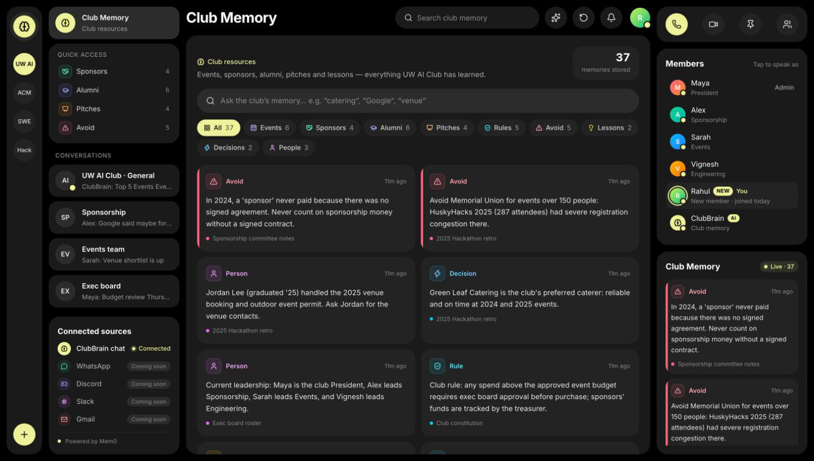

<div align="center">



# 🧠 ClubBrain

**People graduate. Knowledge shouldn't.**

**Institutional memory for student clubs. ClubBrain listens to the club chat, turns decisions, lessons, sponsors and alumni into persistent [Mem0](https://mem0.ai) memories, and answers the next generation's questions with a trace of exactly what it remembered.**

[](https://react.dev)
[](https://www.typescriptlang.org)
[](https://vite.dev)
[](https://tailwindcss.com)
[](https://fastapi.tiangolo.com)
[](https://www.python.org)
[](https://mem0.ai)
[](https://platform.openai.com)

**[🎬 Promo video](./docs/clubbrain-promo.mp4)** · **[📸 Screenshots](#-screenshots)** · **[⚙️ Getting started](#%EF%B8%8F-getting-started)**

🏁 **Built for the /build-with-AI Buildathon (Gen Academy × Mem0 × SVAI) · SF Tech Week 2026**

</div>

---

## 🎬 Promo video

<a href="./docs/clubbrain-promo.mp4">
  
</a>

<p align="center"><sub>▶️ <a href="./docs/clubbrain-promo.mp4">Watch the promo (MP4)</a> — scattered channels collapse into one club memory. Made in code with <a href="https://www.remotion.dev">Remotion</a>.</sub></p>

---

## The problem

Student clubs reset every year. The president graduates, the sponsorship lead takes a job, and the people who knew *why* things worked leave with them.

- **Knowledge lives in chat scroll.** Which sponsor said yes, which venue failed, who the friendly alumni are: it's all buried in group chats nobody re-reads.
- **New members start from zero.** Someone who joins today has no way to ask "what have we already tried?"
- **Mistakes repeat.** The same overcrowded venue gets booked again. The same sponsor gets announced before the contract is signed.

## The solution

ClubBrain sits in the club's group chat as a member with memory.

1. **Capture.** When someone shares something durable ("Google said they need the request 6-8 weeks ahead"), an LLM rewrites it into a clean, self-contained memory, tags it with a category, and saves it to **Mem0** automatically.
2. **Remember.** Every memory is scoped to the club, not to a person, so it survives graduations and leadership changes.
3. **Recall.** When anyone asks a question, ClubBrain retrieves the relevant memories and answers **only** from them.
4. **Show the memory.** Every answer carries a **memory trace**: the question, the Mem0 search, the memories used, and their sources. No black box.

> An earlier conversation changes what the agent does next: a lesson typed into the chat in March is the warning a brand-new member receives in September.

---

## 🎯 Demo story

The app ships with a fictional **UW AI Club** seeded with 37 memories (events, sponsors, alumni, pitches, rules and warnings).

| Step | What happens | What it shows |
|---|---|---|
| 1. **Rahul joins** | Click **Join as new member** → *Continue as Rahul*. | A new member with no history. |
| 2. **Welcomed** | ClubBrain greets Rahul with a 2-line club summary grounded in memory (HuskyHacks 2025, 287 attendees, Google $10k) and suggests what to ask. | Memory-grounded onboarding. |
| 3. **Top events** | *"What are the top 5 events we've run?"* → a table of events with year, attendees, theme and feedback. | Hybrid retrieval pulls every `event` memory, not just the closest few. |
| 4. **Sponsors & alumni** | *"Who are our top sponsors?"* / *"Alumni who can help with sponsors"* | Sponsors linked to the alumni who opened the door (e.g. Priya Nair → Google). |
| 5. **Sponsor pitch prep** | *"Help me prepare a sponsor pitch"* → outline with opening hook, past wins, tiers, alumni intros, and risks/rules. | Memory turns into action: pitch + event + alumni + rule memories combined. |
| 6. **Memory trace** | Click **Why do you know this?** | Question → Mem0 search → N memories → grounded answer, with every source card. |
| 7. **Teach it something** | Post a non-question, e.g. *"Avoid booking the CSE atrium after 6pm, security locks it."* | The message is extracted, categorized and saved to Mem0 live, then shows up in later answers. |

Use **Reset demo** (↻ in the top bar) to clear the chat. Memories stay in Mem0.

---

## 🧠 How memory works

| Stage | Implementation |
|---|---|
| **Capture** | `chat_service.handle_chat` checks whether a message is a question. If not, `llm_service.detect_memory` asks the LLM for strict JSON: either `null` or a third-person, self-contained rewrite plus one of 10 categories (`decision`, `lesson`, `person`, `sponsor`, `event`, `preference`, `warning`, `alumni`, `pitch`, `rule`). |
| **Auto-save** | `memory_service.add_memory` writes it to Mem0 with `MemoryClient.add(..., user_id="uw-ai-club", metadata={category, source, event, year}, infer=False)`. Extraction is done by ClubBrain's own prompt, so Mem0 stores exactly the curated text. The chat shows a *memory saved* card on the message. |
| **Club-scoped identity** | All memories use one `user_id` (`uw-ai-club`), so the memory belongs to the **organization**, not to whoever typed it. Anyone who joins later inherits it. |
| **Hybrid retrieval** | `memory_service.retrieve` runs Mem0 semantic search (`client.search(query, filters={"user_id": ...})`), then adds **category-hinted** memories: keywords like *events*, *sponsors*, *alumni*, *pitch*, *avoid*, *rules* pull those categories (round-robin, max 6 each) from `get_all`. A pitch question also pulls events, alumni and rules. Results are de-duplicated and capped. |
| **Grounded answer** | `llm_service.answer` gets only the retrieved memories and is told never to invent facts, names or numbers. |
| **Memory trace** | Every bot message returns `retrieved_memories`, which the UI renders in the **Memory Trace** panel with category, source and age. |

### Architecture



### The memory loop: an earlier interaction changes the next answer



---

## ✨ Features

- 💬 **Group-chat interface**: iMessage-style club channel with personas (Maya, Alex, Sarah, Vignesh, Rahul); tap a member to speak as them
- 🧩 **Automatic memory capture**: non-question messages are checked by the LLM, rewritten into durable memories, categorized and saved to Mem0 live
- 🔎 **Hybrid retrieval**: Mem0 semantic search plus category-hinted recall so list questions ("top events", "all sponsors") are complete
- 🧾 **Memory trace**: *Why do you know this?* opens the question → search → memories → answer pipeline with every source
- 👋 **New-member onboarding**: *Join as new member* produces a memory-grounded welcome for Rahul
- 📚 **Club Memory browser**: search and filter all memories by category (Events, Sponsors, Alumni, Pitches, Rules, Avoid, Lessons, Decisions, People)
- 📡 **Live memory feed**: right-hand panel shows the newest memories as they land
- 📝 **Sponsor pitch outlines**: hook, past wins, tiers, alumni intros, and risks/rules, all from memory
- 🛟 **Graceful fallbacks**: without a Mem0 key it uses an in-process store; without an LLM key it uses keyword heuristics, so the UI always runs

---

## 📸 Screenshots

<table>
  <tr>
    <td width="50%"></td>
    <td width="50%"></td>
  </tr>
  <tr>
    <td align="center"><sub>Memory Trace: how ClubBrain knew the top 5 events</sub></td>
    <td align="center"><sub>Club Memory: 37 memories by category, searchable</sub></td>
  </tr>
</table>

---

## 🛠️ Tech stack

| Layer | Technology |
|---|---|
| Memory | **Mem0 Platform** (`mem0ai` `MemoryClient`), club-scoped `user_id`, metadata categories |
| LLM | OpenAI `gpt-4o-mini` or Anthropic Claude (Anthropic is used if its key is set; heuristic fallback with no key) |
| Backend | FastAPI, Pydantic, python-dotenv, Uvicorn |
| Frontend | React 19, Vite 8, TypeScript, Tailwind CSS v4, TanStack React Query, lucide-react, react-markdown + remark-gfm |
| Promo video | Remotion 4 (React) |

---

## 📁 Project structure

```
ClubBrain/
├── backend/                  FastAPI service
│   ├── main.py               app, CORS, router
│   ├── routers/api.py        /api/* routes (no business logic)
│   ├── services/
│   │   ├── memory_service.py Mem0 client, hybrid retrieval, seeding, local fallback
│   │   ├── chat_service.py   question vs. knowledge routing, history, welcome
│   │   ├── llm_service.py    memory extraction, grounded answers, welcome text
│   │   └── seed_data.py      fictional UW AI Club demo memories
│   ├── models/schemas.py     Pydantic request/response models
│   ├── requirements.txt
│   └── .env.example
├── frontend/                 React + Vite + TypeScript (atomic design)
│   └── src/
│       ├── components/
│       │   ├── atoms/        Avatar, CategoryBadge, Markdown, TypingIndicator, …
│       │   ├── molecules/    MessageRow, MemoryCard, WelcomeModal, PersonaSwitcher, …
│       │   └── organisms/    ChatView, MemoryTracePanel, MemoryBrowser, RightPanel, …
│       ├── pages/Home.tsx
│       ├── services/api.ts   all API calls
│       ├── hooks/            React Query hooks
│       ├── types/            shared TypeScript types
│       └── lib/              personas, category styles
├── video/                    Remotion promo video
└── docs/                     screenshots, promo video and poster
```

---

## ⚙️ Getting started

### Prerequisites

- Python 3.10+
- Node.js 20.19+ (required by Vite 8)
- A [Mem0](https://app.mem0.ai) API key
- An OpenAI **or** Anthropic API key

### 1. Backend

```bash
cd backend
python -m venv venv
venv/bin/pip install -r requirements.txt
cp .env.example .env          # then fill in the keys below
venv/bin/uvicorn main:app --port 8001
```

`backend/.env`:

| Variable | Description |
|---|---|
| `MEM0_API_KEY` | Mem0 Platform key. Without it, memories live in process memory only. |
| `OPENAI_API_KEY` | Uses `gpt-4o-mini` for extraction and answers. |
| `ANTHROPIC_API_KEY` | Optional alternative; takes priority over OpenAI when set. |

### 2. Seed the club memory

```bash
curl -X POST "http://localhost:8001/api/seed?reset=true"
# {"count": 37}
```

`reset=true` wipes the club's memories first; without it, seeding is skipped if the club is already seeded.

### 3. Frontend

```bash
cd frontend
npm install
npm run dev
```

Open the URL Vite prints (default `http://localhost:5173`). The dev server proxies `/api` to **`http://localhost:8001`** (see `frontend/vite.config.ts`), so keep the backend on port 8001.

---

## 🔌 API reference

All routes are prefixed with `/api`.

| Method | Path | Body / query | Description |
|---|---|---|---|
| `GET` | `/api/health` | | Status, memory backend (`mem0` / `local`) and LLM provider |
| `GET` | `/api/messages` | | Chat history (in-memory) |
| `POST` | `/api/chat` | `{sender, content}` | Questions get a memory-grounded answer with `retrieved_memories`; other messages are checked for durable knowledge and auto-saved (`detected_memory`) |
| `GET` | `/api/memories` | `?q=&category=` | List all club memories, or semantic search with `q`, filtered by category |
| `POST` | `/api/memories` | `{text, category, source}` | Add a memory manually |
| `POST` | `/api/seed` | `?reset=true` | Seed the 37 demo memories (optionally wiping first) |
| `POST` | `/api/welcome` | `{member, role}` | Memory-grounded welcome message for a new member |
| `POST` | `/api/reset-chat` | | Clear chat history (memories are kept) |

---

## 🎞️ Promo video (source)

The promo is a React composition in [`video/`](./video), rendered with Remotion.

```bash
cd video
npm install
npm run studio    # preview in Remotion Studio
npm run render    # → video/out/clubbrain-promo.mp4
```

The rendered cut is committed at [`docs/clubbrain-promo.mp4`](./docs/clubbrain-promo.mp4).

---

## 🗺️ Roadmap

Today ClubBrain captures memory from its own group chat. The connectors in the sidebar are marked *Coming soon* and are **not implemented yet**.

- [ ] **Channel connectors**: ingest WhatsApp, Discord, Slack and Gmail threads into the same club memory
- [ ] **Photon iMessage bridge**: let members text ClubBrain directly
- [ ] **Permissions**: role-based access (exec board vs. members) to sensitive memories
- [ ] **Private memories**: per-member notes alongside the shared club memory
- [ ] **Memory timeline**: browse how the club's knowledge evolved year over year
- [ ] **Multi-club workspaces**: the rail already shows ACM, SWE and Hack as future clubs

---

## 🏁 Hackathon context

Built at the **/build-with-AI Buildathon** by Gen Academy × Mem0 × SVAI during **SF Tech Week (October 5, 2026)**.

- **Theme:** *Show the memory*: demonstrate how an earlier interaction changes what your agent does next.
- **Track:** Agents for small businesses / organizations.
- **How ClubBrain fits:** a message saved months ago changes what ClubBrain tells a brand-new member today, and the memory trace shows exactly which memories caused it.

All club data (people, sponsors' details, events) is **fictional demo data**.

---

## 👤 Author

**Vignesh** · [@Vignesh-1822](https://github.com/Vignesh-1822)

## 📄 License

[MIT](./LICENSE) © 2026 Vignesh
